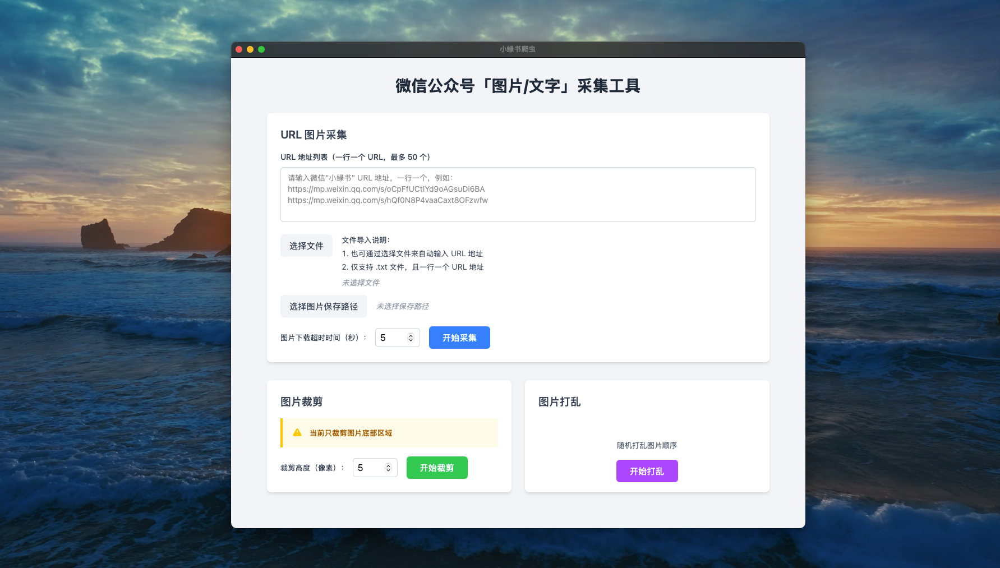

# wxGraphCrawler

<p align="center" style="text-align: center">
  <br/>
</p>

## 项目简介

`wxGraphCrawler` 是一个使用 [Wails](https://wails.io) 开发的专门用于抓取微信公众号“图片/文字”类型（俗称：小绿书）图片的桌面软件应用程序。  

## 应用截图




## 功能特性

- 基于 Wails 的跨平台桌面应用（支持 macOS、Linux、Windows 等操作系统）
- 微信公众号“小绿书”图片抓取
- 性能高效，使用 goroutine 高并发异步下载图片
- SQLite3 本地数据存储
- 本地化数据处理，保护数据安全
- 内置日志系统，支持日志文件分割、压缩等功能

## 支持的平台

- Windows 10/11 AMD64/ARM64
- MacOS 10.13+ AMD64
- MacOS 11.0+ ARM64
- Linux AMD64/ARM64

## 技术栈

### 后端
- Go
- Wails v2
- SQLite3
- Zap Logger
- Goquery

### 前端
- Vue 3
- Vue Router
- Element Plus
- TailwindCSS

## 安装说明

### 以下为本人本地开发时软件版本

- Go version go1.23.9 darwin/amd64
- Wails version v2.10.1
- Node.js version 22.15.1
- npm version 10.9.2

### 从源码构建

1. 需要先安装 [Wails](https://wails.io/zh-Hans/docs/gettingstarted/installation)
2. 克隆项目

```bash
git clone https://github.com/pudongping/wx-graph-crawl.git
cd wx-graph-crawl
```

3. 本地运行

> 这将运行一个 Vite 开发服务器，为您的前端更改提供非常快速的热重载。如果您想在浏览器中开发并访问您的 Go 方法，还可以运行一个开发服务器，地址为 `http://localhost:34115` 在浏览器中连接到此地址，您可以通过开发工具调用您的 Go 代码。

```bash
make dev
# 或者执行 wails dev
# wails dev 本地开发相关命令行： https://wails.io/zh-Hans/docs/reference/cli/#%E5%BC%80%E5%8F%91
# wails 手动构建过程： https://wails.io/zh-Hans/docs/guides/manual-builds
```

4. 构建应用

```bash
make build
# 或者执行 wails build
```

## 启动打包好的应用，遇到的常规问题

### 1. macOS 上双击无法打开？

如果在 macOS 上打包之后发现双击无法打开时，你需要：  
对着 `wxGraphCrawler.app` 右键 -> 显示包内容 -> Contents -> MacOS  
然后在终端中执行 `chmod +x ./wxGraphCrawler`  
之后就可以双击打开了  
能够打开之后，你也可以直接将 `wxGraphCrawler.app` 拖到应用程序中，这样就能够在 Launchpad 中找到它了  

### 2. 应用报错，不知道原因？

你可以查看和二进制应用 `wxGraphCrawler` 同目录下的 `.wxGraphCrawler/logs/crawl.log` 日志文件，查看具体的报错信息。

> `.wxGraphCrawler` 是隐藏文件夹，macOS 和 Linux 系统下可以使用 `ls -al` 命令查看，Windows 系统下需要在资源管理器中打开隐藏文件夹选项。

## 使用方法

1. 启动应用
2. 在界面中输入想要抓取的微信“小绿书”链接地址（**⚠️特别注意：不是“小绿书”链接地址将无法采集图片，可能会报错**）
   - 例如：https://mp.weixin.qq.com/s/xxxxxx
   - 支持单个链接和多个链接（一行一个链接地址）
3. 点击【选择图片保存路径】，然后点击【开始采集】按钮开始采集

## 项目结构

```
wx-graph-crawl/
├── frontend/          # 前端代码
│   ├── src/          # 源代码
│   └── dist/         # 构建输出
├── backend/          # 后端代码
│   ├── configs/      # 配置文件
│   ├── handlers/     # 请求处理器
│   ├── service/      # 业务逻辑
│   └── utils/        # 工具函数
├── build/            # 构建相关文件
├── main.go           # 主程序入口
├── app.go            # 应用配置
└── wails.json        # Wails 配置文件 https://wails.io/zh-Hans/docs/reference/project-config/
```

## Star History

<a href="https://star-history.com/#pudongping/wx-graph-crawl&Date">
 <picture>
   <source media="(prefers-color-scheme: dark)" srcset="https://api.star-history.com/svg?repos=pudongping/wx-graph-crawl&type=Date&theme=dark" />
   <source media="(prefers-color-scheme: light)" srcset="https://api.star-history.com/svg?repos=pudongping/wx-graph-crawl&type=Date" />
   
 </picture>
</a>

## 贡献指南

欢迎提交 Issue 和 PR！

## 许可证

[MIT License](LICENSE)